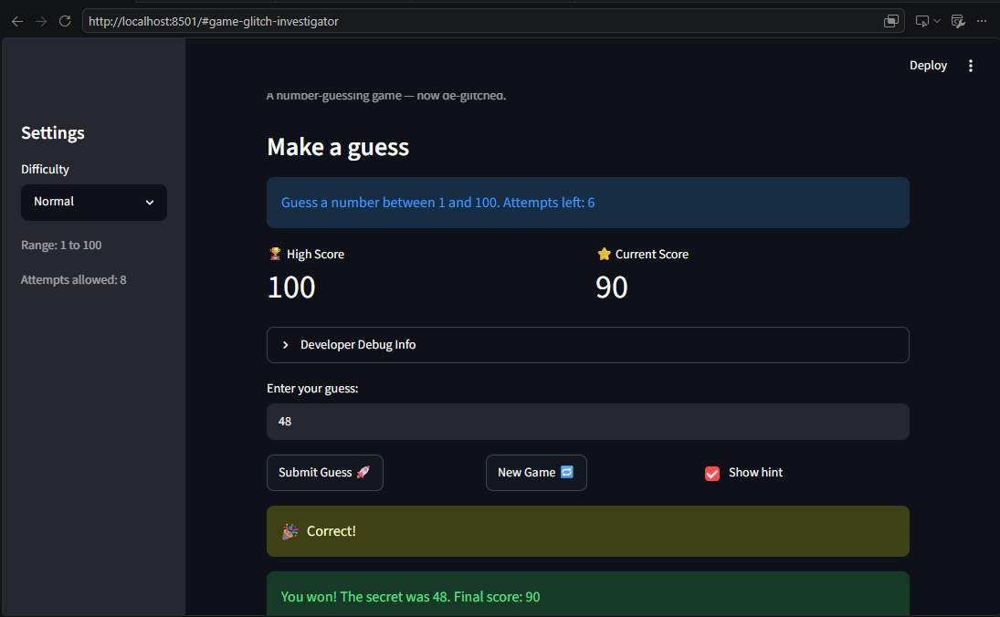

# 🎮 Game Glitch Investigator: The Impossible Guesser

## 🎯 Purpose

A Streamlit number-guessing game that shipped full of bugs from an AI that
claimed the code was "production-ready." The goal of this project was to
**play the broken game, reproduce and diagnose the bugs, fix them, and verify
the fixes with tests** — then document the whole debugging process, including
where AI helped and where it was wrong. The player picks a difficulty, guesses
a hidden number within a limited number of attempts, and earns a score.

## 🛠️ Setup

1. Install dependencies: `pip install -r requirements.txt`
2. Run the app: `python -m streamlit run app.py`
3. Run the tests: `python -m pytest tests/`

## 🐞 Bugs Found

All four were real, reproducible bugs in the starter code (see the Bug
Reproduction Log in [reflection.md](reflection.md)):

- [x] **Backwards hints** — `check_guess` told you to go *higher* when your
  guess was already too high (and vice versa).
- [x] **Secret cast to a string** — on every even attempt, `app.py` ran
  `secret = str(st.session_state.secret)`, so an `int` guess was compared
  against a `str`. Comparisons broke and a correct guess could fail to win.
- [x] **Broken scoring** — `update_score` *added* points for some wrong
  guesses and allowed the score to go negative.
- [x] **"New Game" did not reset state** — it ignored the difficulty range
  (always 1–100) and never reset the score, status, or history, so old rounds
  leaked into new ones. The difficulty range itself was also wrong ("Hard" was
  *easier* than "Normal").

## 🔧 Fixes Applied

- [x] **Refactored** the four core functions out of `app.py` into
  [logic_utils.py](logic_utils.py) so they can be unit-tested without
  Streamlit.
- [x] **Hints fixed** — outcome and hint text are now separated
  (`check_guess` returns the outcome string; `hint_message` returns the text),
  and the directions are correct ("Too high — go LOWER").
- [x] **Type bug fixed** — the guess is always compared to the integer secret;
  the `str(...)` cast was removed entirely.
- [x] **Scoring fixed** — every wrong guess costs a flat 5 points and the
  score is clamped with `max(0, ...)` so it never goes negative.
- [x] **State fixed** — a `start_new_round()` helper resets the secret (using
  the correct difficulty range), attempts, score, status, and history; the
  difficulty ranges were corrected so Hard (1–200) is harder than Normal
  (1–100).

## 📝 Document Your Experience

- [x] Describe the game's purpose. *(see Purpose above)*
- [x] Detail which bugs you found. *(see Bugs Found)*
- [x] Explain what fixes you applied. *(see Fixes Applied)*

## 📸 Demo Walkthrough

A reader can follow along without a video:

1. Run `python -m streamlit run app.py` and choose **Normal** difficulty in the
   sidebar (range shows "1 to 100", 8 attempts allowed).
2. Type a guess and click **Submit Guess 🚀**. The hint now points the right
   way — guess too high and it says "📉 Too high — go LOWER!" — with a Hot/Cold
   emoji (🔥/🌡️/❄️/🧊) showing how close you are.
3. Keep guessing. The **⭐ Current Score** metric and the **📜 Guess History**
   table update after every valid guess.
4. Guess the secret to win: balloons appear, and if your score beats the
   previous best it is saved to the **🏆 High Score** metric.
5. Click **New Game 🔁**. The board fully resets (new secret in the correct
   range, score back to 0), but the High Score persists across rounds.

**Screenshot** *(optional)*: <!-- Insert a screenshot of your fixed, winning game here -->

## 🧪 Test Results

```
$ python -m pytest tests/ -v
============================= test session starts =============================
collected 10 items

tests/test_game_logic.py::test_winning_guess PASSED                      [ 10%]
tests/test_game_logic.py::test_guess_too_high PASSED                     [ 20%]
tests/test_game_logic.py::test_guess_too_low PASSED                      [ 30%]
tests/test_game_logic.py::test_parse_guess_rejects_non_numeric PASSED    [ 40%]
tests/test_game_logic.py::test_parse_guess_handles_empty_and_whitespace PASSED [ 50%]
tests/test_game_logic.py::test_parse_guess_rejects_decimals PASSED       [ 60%]
tests/test_game_logic.py::test_parse_guess_accepts_negative_numbers PASSED [ 70%]
tests/test_game_logic.py::test_score_never_goes_negative PASSED          [ 80%]
tests/test_game_logic.py::test_wrong_guess_penalty_is_consistent PASSED  [ 90%]
tests/test_game_logic.py::test_unknown_difficulty_falls_back_to_normal PASSED [100%]

============================= 10 passed in 0.11s ==============================
```

## 🚀 Stretch Features

- [x] **Advanced Edge-Case Testing (SF7)** — 7 additional pytest cases cover
  non-numeric input, empty/whitespace/`None`, decimals, negative numbers, the
  score floor, and unknown-difficulty fallback. All 10 tests pass (above).
  Rationale for each is logged in [ai_interactions.md](ai_interactions.md).
- [x] **Feature Expansion via Agent Mode (SF8)** — added a persistent
  **High Score tracker** (survives "New Game") and a **Guess History** table.
  Implemented in [app.py](app.py) via `start_new_round()`, `st.session_state`,
  and `st.table`. Workflow documented in [ai_interactions.md](ai_interactions.md).
- [x] **Professional Documentation and Style (SF9)** — Google-style docstrings
  on every function in [logic_utils.py](logic_utils.py); `pycodestyle` reports
  no style issues. Prompt and linting output are in
  [ai_interactions.md](ai_interactions.md).
- [x] **Enhanced Game UI and Formatting (SF10)** — emoji **Hot/Cold** proximity
  hints (`hot_or_cold()`), `st.metric` banners for High Score and Current
  Score, and the `st.table` **Guess History** summary. These improve player
  feedback without changing the core game logic.
- [x] **AI Model / Prompt Comparison (SF11)** — a ChatGPT vs. Gemini
  comparison on the `update_score` bug is documented in
  [ai_interactions.md](ai_interactions.md).
